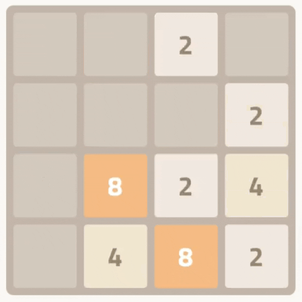

# 2048 Clone - Unity Engine

This repository contains a clone of the popular 2048 game, developed using the Unity game engine. The game faithfully replicates the classic 2048 gameplay mechanics, where the player combines numbered tiles to achieve higher numbers, ultimately aiming to reach the 2048 tile.

  

## Features

- **Flexible Grid System:** The game utilizes a `TileGrid` class, which facilitates a dynamic grid layout for the tiles.
- **Tile Movement & Merging:**  Implemented in the `Board` class, the game supports smooth tile movement and merging, creating an engaging user experience.
- **Tile Animation:** Tile movements are accompanied by animations for a more visually appealing gameplay, managed through the `Tile` class. (DOTween)
- **Singleton Pattern:** Used in the `GameManager` class to manage game states and score, ensuring a single instance in the game.
- **Observer Pattern:** Implemented using events and delegates (like `OnGameOver` and `OnScoreUpdate` in `GameManager`), allowing for event-driven communication between objects.
- **Scriptable Object:** We used Scriptable Objects for our Tiles and their colors. Therefore, we handled our coloring easily by storing the Color data in our "TileStateSO.cs" script.

## How to Play

- Control the tiles using arrow keys (↑, ↓, ←, →) or W, A, S, D keys.

## Getting Started

1. Clone this repository.
2. Open the project in Unity.
3. Play or build the game to try it out.

## Prerequisites

- Unity version 202x.x or newer.